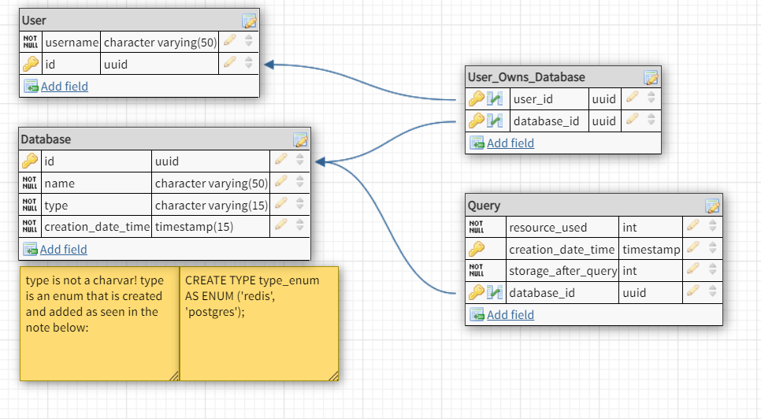

# Hemiron User Registration Database

This document describes the structure of the Hemiron user registration database. Hemiron is a data warehouse that provides consumers with the service of creating and managing databases. The data of each of these users is stored in a Postgres database.

## Design Process

The design of the database will be divided into three phases: inventory, conceptual model, and normalization.

In the inventory phase, we will look at all the possible data that needs to be stored. For each piece of data, we will analyze the form in which it needs to be stored and its use case. Based on this, a list of related and relevant attributes will be forwarded to phase two; The Conceptual Model Phase.

In the conceptual model phase, we will examine the relationships between the entities. The frameworks of each entity will be established along with the corresponding attributes. Major changes are still possible at this point.

In the final phase, normalization, we will look at efficiently storing the above data. This will involve examining the concrete storage process. Coupling tables can be set up at this point and the most optimal indexing of the data will be determined.

## Inventory

The primary goal for Team Databases, also known as the Minimum Viable Product, consists of the following points:

- Each user pays on a usage basis
- Usage is measured in disk space (HDD/SSD) * time and resource usage per query (CPU/RAM) * time
- All information must be stored (this is critical)
- The database can be a Redis or Postgres database

The following point has also been included as optional:

- The same database name can occur multiple times for different users

From this, we can determine the following minimum requirements:

- User name
- User queries (list)
- Query date and time (timestamp)
- Query resource usage (CPU) * time
- Total disk space in use after query (gigabytes)
- Monthly cost for queries (euros)
- Monthly cost for storage (euros)
- Database name
- Database creation date and time
- Database type (Redis vs. Postgres)

## Conceptual Model
In the conceptual model phase, the different attributes from the inventory phase can be modeled as entities and relationships. This has led to the following Conceptual model.

### Costs
The Conceptual Model does not include a Costs entity, because these can be calculated based on the values in the Query table.

The costs are divided into two types:

CPU usage costs
Storage usage costs
Calculating CPU costs
The CPU usage costs can be simply calculated by adding up the Resource_used for all queries within a certain period (month) and multiplying it by the price set by Hemiron per unit of CPU consumption.

| id      | Date        | Storage_after_Query | Resource_used |
|---------|-------------|---------------------|---------------|
| #23445  | 1-1-2022    | 10GB                | 40ms          |
| #23446  | 21-1-2022   | 20GB                | 270ms         |
| #23447  | 31-1-2022   | 0GB                 | 380ms         |

The total CPU costs will be 40+270+380=690ms * X, where X = cost per ms.

Calculating storage costs
The storage usage costs can be calculated by comparing each query with a time period and a 'storage_after_query' value. These can be multiplied together to create a total picture of costs per query, which can then be added together for the total costs for all queries.

An example query list for a database in January might be:

| id      | Date        | Storage_after_Query | Resource_used |
|---------|-------------|---------------------|---------------|
| #23445  | 1-1-2022    | 10GB                | 40ms          |
| #23446  | 21-1-2022   | 20GB                | 270ms         |
| #23447  | 31-1-2022   | 0GB                 | 380ms         |

And this would produce the following: 

| id      | Datum(ID+1) – Datum(ID)     | Datum(ID+1) – Datum(ID) | Storage_after_Query  | Costs |
|---------|-----------------------------|-------------------------|----------------------|-------|
| #23445  | "21-1-2022" - "1-1-2022"    | 20                      | 10GB                 | 200   |
| #23446  | "31-1-2022" - "21-1-2022"   | 10                      | 20GB                 | 200   |
| #23447  | "1-2-2022" - "31-1-2022"    | 1                       | 0GB                  | 0     |

Despite the fact that the first query used 10GB and the second query only used 20GB, we see that Queries 1 and 2 have the same costs in terms of storage. This is because after the second query, only 20GB was used for 10 days, while after the first query, 10GB was used for 20 days.

## Normalization

Since there is no guarantee that the username is unique, an ID is required. The student number UUID is used here, which is provided by the authentication.
Each user has the ability to manage 0, 1, or multiple databases. Each database can be managed by 1 or more users. The database_id is a unique UUID with auto increment.
The database no longer has a 'storage_used' attribute because this can always be found in the most recent query. (Each database must have at least 1 query at the time of creation of the database).
For programming convenience, a View can be added here to retrieve the db_storage_used from the database, as well as a list of users who have access to that database.

This table schema has been normalized to second normal form, because normalizing to third normal form leads to impractical code. This is because, according to third normal form, the Query table should not contain a 'storage_after_query' attribute because it is an attribute of the database, not an attribute of the Query. However, in this case it is more efficient to keep the 'storage_after_query' attribute with each query because the timestamp of this change always corresponds to the timestamp of a query. In this way, you save fewer total data because you avoid redundant double-saved timestamps.

src: Database Normalization Description - Office, 2022

### Entity Relationship Diagram

## References:
[Database normalization description - Office](https://learn.microsoft.com/en-us/office/troubleshoot/access/database-normalization-description) (2022, May 5). Microsoft Learn.

# TODO
-[ ] #TODO: update to most recent model after remodelling changes of 22-12-2022

